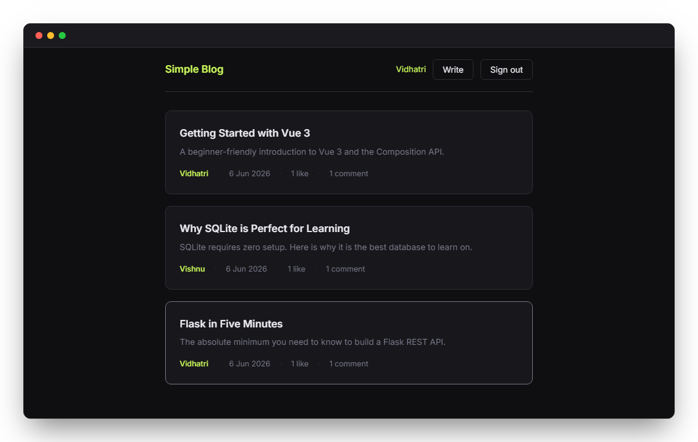
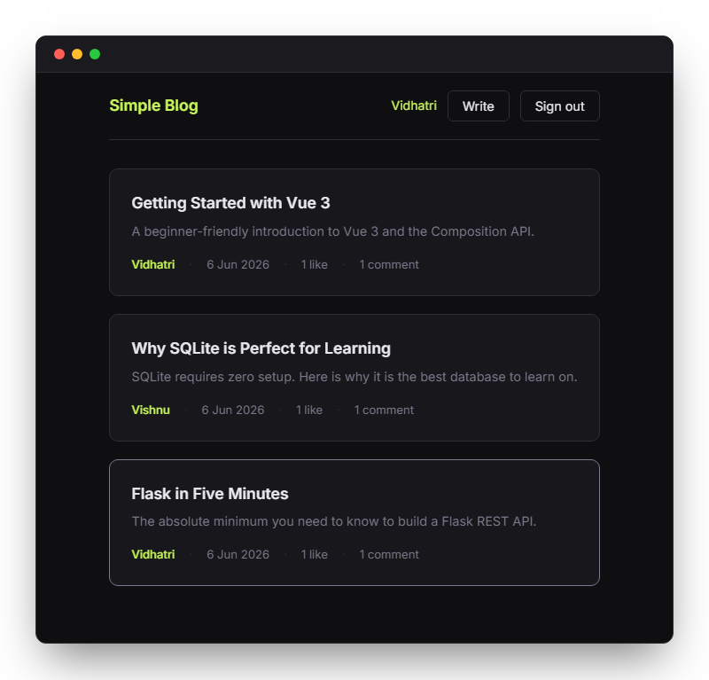
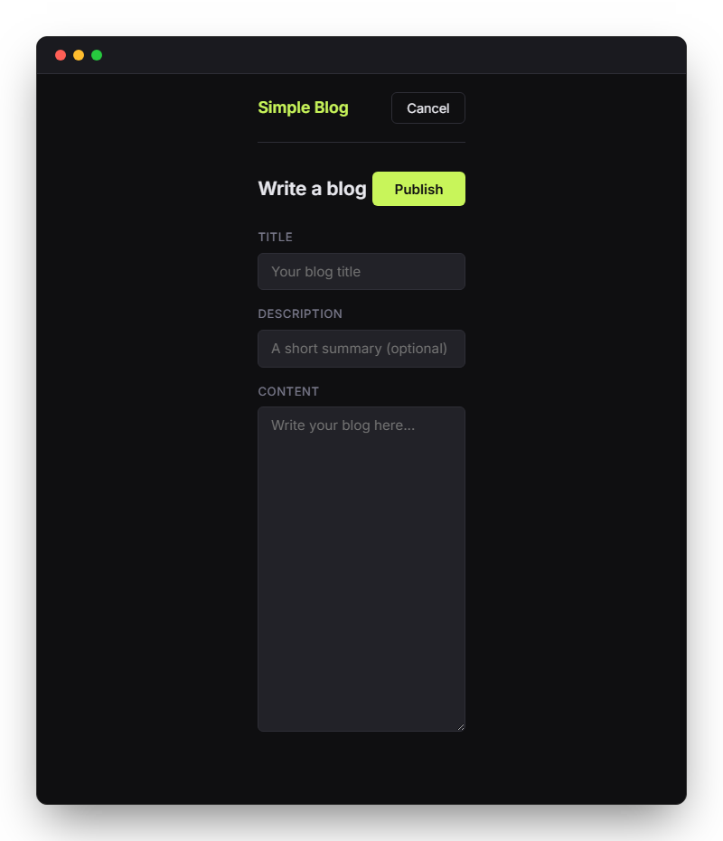
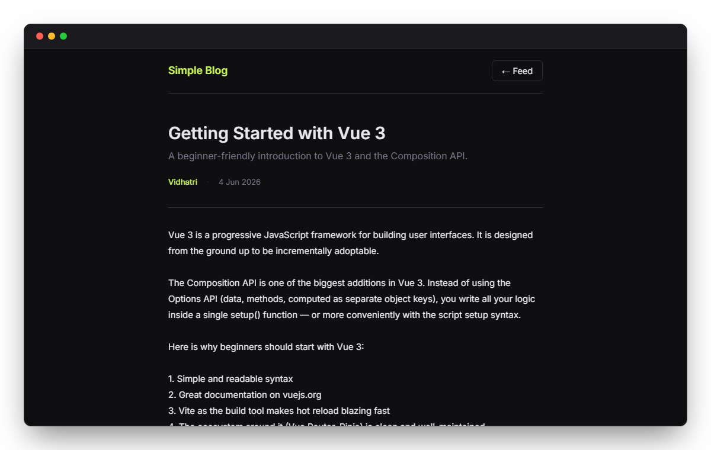
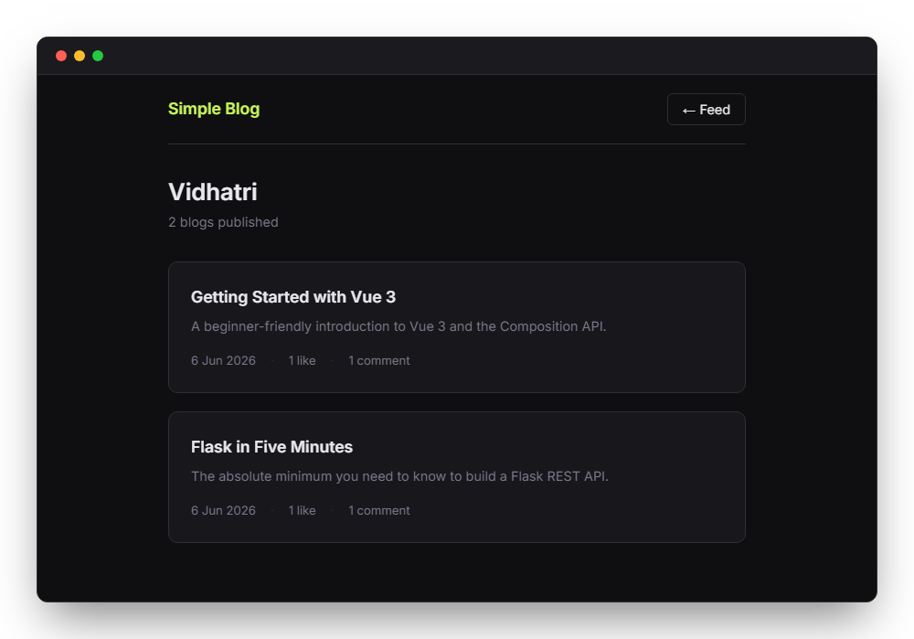
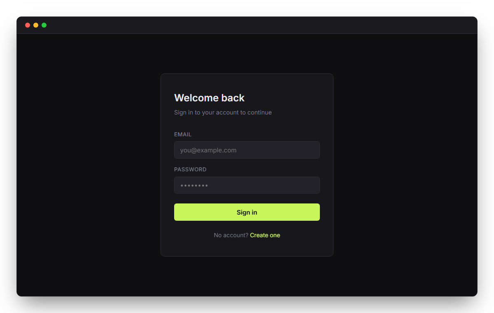

# Simple Blog App

<p align="center">
  
</p>

A full-stack blogging application where users can write, read, like, and comment on blogs.

**Stack:** Flask · SQLite · Vue 3 (Vite)

---

## Project Structure

```
simple-blog-app/
├── backend/
│   └── routes/
└── frontend/
    └── src/
        ├── components/
        ├── composables/
        ├── router/
        ├── utils/
        └── views/
```

---

## Routes

| Path               | View           | Description                       |
| ------------------ | -------------- | --------------------------------- |
| `/`                | `LoginView`    | Login page                        |
| `/register`        | `RegisterView` | Registration page                 |
| `/feed`            | `FeedView`     | All blogs, newest first           |
| `/write`           | `WriteView`    | Compose a new blog                |
| `/blog/:slug`      | `BlogView`     | Full blog with likes and comments |
| `/profile/:userId` | `ProfileView`  | All blogs by a user               |

### API endpoints

#### Auth
| Method   | URL                          | Description              |
| -------- | ---------------------------- | ------------------------ |
| `POST`   | `/api/register`              | Create account           |
| `POST`   | `/api/login`                 | Log in                   |
| `POST`   | `/api/logout`                | Log out                  |
| `GET`    | `/api/whoami`                | Current user info        |

#### Blogs
| Method   | URL                          | Description              |
| -------- | ---------------------------- | ------------------------ |
| `GET`    | `/api/blogs`                 | List all blogs           |
| `POST`   | `/api/blogs`                 | Create a blog            |
| `GET`    | `/api/blogs/<slug>`          | Get a blog with comments |
| `GET`    | `/api/users/<id>/blogs`      | Get all blogs by a user  |

#### Interactions
| Method   | URL                          | Description              |
| -------- | ---------------------------- | ------------------------ |
| `POST`   | `/api/blogs/<slug>/like`     | Toggle like              |
| `POST`   | `/api/blogs/<slug>/comments` | Add a comment            |
| `DELETE` | `/api/comments/<id>`         | Delete a comment         |

---

## Running the Application

### Backend

```bash
cd backend
pip install -r requirements.txt
python app.py
```

Runs on `http://localhost:5000`. On first run, creates the database and seeds demo data.

### Frontend

```bash
cd frontend
npm install
npm run dev
```

Runs on `http://localhost:5173`.

---

## Screenshots

Path: `/feed` — Global Feed


Path: `/write` — Write Blog


Path: `/blog/:slug` — Blog View


Path: `/profile/:userId` — User Profile


Path: `/` — Login Page

